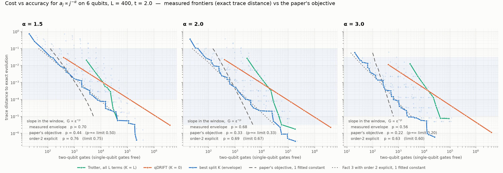
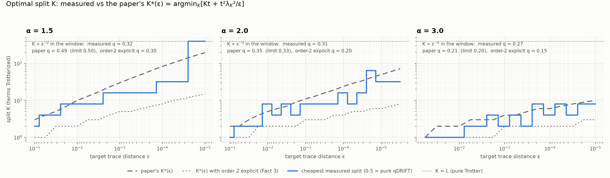

# Where to cut a Hamiltonian: measuring the Zlokapa–Allen–Harrow objective in Q#

A Q# demo of the main result of *Optimal Lower Bounds for Hamiltonian Simulation*
(Zlokapa, Allen, Harrow — [arXiv:2607.19852](https://arxiv.org/abs/2607.19852)).

## The claim

Write the Hamiltonian as H = Σⱼ aⱼ hⱼ with ‖hⱼ‖ = 1, coefficients sorted a₁ ≥ a₂ ≥ … ≥ a_L
and normalised Σⱼ aⱼ = 1, and let λ_K = Σ_{j>K} aⱼ be the *tail mass* left after the K
largest terms. The paper proves that simulating e^{−iHt} to trace-distance error ε costs

  **G = Θ( min₀≤K≤L [ K·t + t²·λ_K²/ε ] )**  two-qubit gates (single-qubit gates free),

where the lower bound is a worst case over Hamiltonians with those term norms (Theorem 1)
and the upper bound holds for all of them: the Hagan–Wiebe composite channel — high-order
Trotterization of the K largest terms, qDRIFT on the remaining tail, with K chosen
optimally — reaches the minimum up to a (t/ε)^{o(1)} factor. Two familiar algorithms are
the endpoints of the same minimisation: K = L is plain Trotter (cost L·t, no 1/ε term),
K = 0 is plain qDRIFT (cost t²/ε, no L). A demo on one instance checks the upper-bound
side: that the composite's cost follows the objective and is set by the minimisation over K.

The objective has two consequences one can measure:

1. **The optimal cut K*(ε) moves.** Lemma 5 characterises it. For the power-law
   coefficient profiles the paper highlights as the physically relevant case
   (aⱼ ∝ j^{−α}, so λ_K ∝ K^{1−α}), a short calculation with the objective gives
   K* ∝ ε^{−1/(2α−1)} (the paper names power laws as the motivating case but does not
   itself write out this exponent).
2. **The gate count is polynomial in 1/ε,** G ∝ ε^{−1/(2α−1)} by the same calculation, even though query-model
   methods advertise log(1/ε) — the paper's point being that the L-dependence of a
   block encoding is not an artefact that can be optimised away.

This repo builds power-law Hamiltonians on 6 qubits, implements the composite channel in
Q#, sweeps the cut K, and measures both consequences with an exact error metric.

## What it measures

**Hamiltonians.** L = 400 random Pauli strings of weight ≤ 3 on 6 qubits (so every term
costs O(1) two-qubit gates, as the gate model assumes), with |aⱼ| ∝ j^{−α} for
α ∈ {1.5, 2, 3}, random signs, Σ|aⱼ| = 1, evolved for t = 2.

**Simulators.** All three are the same Q# code at different K:
- `TrotterEvolve` — Suzuki product formulas of order 2 and 4 over all L terms (K = L).
- `QDriftEvolve` — Campbell's randomized first-order channel over all terms (K = 0).
- `CompositeEvolve` — the Hagan–Wiebe channel exactly as the paper's Fact 3 uses it: an
  outer order-2k Suzuki formula over the two "terms" A (largest K) and B (the rest), each
  A-factor implemented by an inner order-2k formula on A's terms, each B-factor by a
  qDRIFT segment of N_B samples.

**Error: exact trace distance.** The paper's metric is trace distance; qDRIFT and the
composite are *channels*, whose error is a property of the average output. Estimating
that from sampled circuits is biased and slow (the trace norm of the sampling error is of
order √(d/M), so at d = 64 resolving ε = 10⁻² takes shots of the order of 10⁶), so instead the channels are evaluated exactly: one qDRIFT sample is
the linear map E(ρ) = cos²τ·ρ − i cosτ sinτ [B/λ_B, ρ] + sin²τ·Σⱼ pⱼ PⱼρPⱼ on 64×64
density matrices, a segment is its m-th power, and the deterministic factors are unitary
conjugations. `channels.py` mirrors the gate order of the Q# operations exactly, and
`verify.py` checks that the Q# circuits sample from precisely these channels (see below).
The error is on one fixed entangled input state; the paper's bound is over the worst
case, which is ≥ this.

**Cost: two-qubit gates.** The paper's currency. Q#'s `Exp` on a weight-w Pauli lowers to
an `Rzz` inside a `SpreadZ` CNOT ladder, which the resource estimator counts as 2(w−1)
CNOTs (`Rzz` itself is lowered to `cx, rz, cx`; checked in the QDK source), and that is
the count used here. On hardware with a native `Rzz` the same exponential is 2w−3
two-qubit gates. For this term pool the difference is a uniform factor of about 1.4 across
every strategy, so it moves the frontiers together and changes neither the ratios nor the
fitted exponents. Single-qubit rotations are free. Rotation counts are also recorded and
cross-checked against `qsharp.logical_counts`. For the randomized parts the two-qubit
count is the expectation over the sampled terms.

**The sweep.** For every α: K = L with orders 2/4 and r up to 128; K = 0 with N up to
10⁶; and K ∈ {1, 2, 4, …, 256} with outer/inner order 2 or 4, r ∈ {1…16}, N_B ∈ {K/4, K, 4K}.
Everything is exact — no shots, no error bars.

## Results





Exact trace distance on a fixed entangled input versus two-qubit gates, for every
configuration swept (faint dots), with the Pareto frontier of each strategy. The
"window" shaded in the frontier figure is where the paper's own K* is interior
(2 ≤ K* ≤ L/4); all fits are done inside it. Full tables are in
[`results/summary.txt`](results/summary.txt).

### Best split against the two endpoints

| α | best split vs plain Trotter | best split vs plain qDRIFT |
|---|---|---|
| 1.5 | 15× → 3.5× cheaper (ε from 2×10⁻² to 10⁻⁴) | 3× → 17× |
| 2.0 | 27× → 1.5× (ε from 2×10⁻² to 3×10⁻⁶) | 4× → 72× |
| 3.0 | 49× → 17× (ε from 10⁻² to 10⁻⁵) | 7× → 195× |

Inside the window neither endpoint is ever the cheapest. The advantage over Trotter
shrinks as ε → 0 at fixed L — the cut K* creeps toward L and the objective flattens —
and grows with α, because a steeper tail puts the "spectral weight" into fewer terms,
which is exactly the regime Hagan–Wiebe identify as favourable.

### Envelope exponent against the objective

Fitted G ∝ ε^{−p} inside the window:

| α | measured envelope | paper's `min_K[Kt + t²λ_K²/ε]` | same, order-2 Trotter cost explicit (Fact 3) |
|---|---|---|---|
| 1.5 | **0.70** | 0.44 (p→∞ limit 0.50) | **0.76** (limit 0.75) |
| 2.0 | **0.68** | 0.33 (limit 0.33) | **0.69** (limit 0.67) |
| 3.0 | **0.56** | 0.22 (limit 0.20) | **0.63** (limit 0.60) |

The dotted theory line in the figure — Hagan–Wiebe's cost Υ(ΥL_A + N_B) with r ∝ (t/ε)^{1/2}
for order 2, scaled by one constant — lies on the measured envelope across the whole
window, for all three α. The dashed line, the paper's idealised objective, is far too
steep. The reason is not a flaw in the theorem: the paper's Trotter term is
K·t·(t/ε)^{o(1)}, the o(1) being the exponent of an order-2p formula taken to p → ∞. A
real implementation picks p, and the envelope here is built almost entirely from order-2
configurations, whose (t/ε)^{1/2} is anything but small. Carrying that factor through the
same minimisation gives p = (1 − 1/2p)/(2α−1) + 1/2p, and that is what the measurement
returns.

So the demo confirms the *form* of the bound and its consequences, and shows concretely
how much of the exponent ε^{−1/(2α−1)} is asymptotic in the Trotter order.

### Where the cut lands

Fitted K ∝ ε^{−q} for the measured cheapest split, against the two versions of K*(ε):

| α | measured | paper's K* | order-2-explicit K* |
|---|---|---|---|
| 1.5 | 0.32 | 0.49 | 0.30 |
| 2.0 | 0.31 | 0.35 | 0.20 |
| 3.0 | 0.27 | 0.21 | 0.15 |

The magnitude of the measured K* sits between the two predictions at every ε (the
idealised objective over-predicts the cut, the Hagan–Wiebe upper-bound constants
under-predict it), and its exponent lies between theirs. Where exactly to cut depends on
the constants the bound drops — the ratio of the Trotter and qDRIFT prefactors — but the
paper's Lemma 5 gets the power law and the order of magnitude right with no fitting.

### Resource estimates (α = 2, `results/estimates_alpha2.0.txt`)

Cheapest measured configuration of each strategy reaching D ≤ 10⁻⁴, through the full
resource estimator (`qubit_gate_ns_e4`, surface code, error budget = target):

| strategy | configuration | 2q gates | T states | runtime |
|---|---|---|---|---|
| best split | K = 16, order 2, r = 8, N_B = 64 | **3,830** | **19,684** | **69 ms** |
| plain Trotter | K = 400, order 4, r = 2 | 28,120 | 160,240 | 545 ms |
| plain qDRIFT | N = 31,623 | 125,575 | 664,335 | 2.6 s |

### First version

The first version fixed the split at the "obvious" physical boundary (a TFIM backbone
vs. a bath) and reported that composite loses to Trotter below ε ≈ 10⁻⁵. That was an
artefact of never moving K: the paper's algorithm *is* the minimisation over K, and
plain Trotter is its K = L endpoint. Once K is swept, the min-over-K envelope beats both
endpoints throughout, exactly as the theorem says. The metric was also infidelity on
Monte-Carlo samples; it is now the paper's trace distance, computed exactly.

## Running it

```bash
python3 verify.py          # correctness checks — run this first (~1 min)
python3 experiment.py      # the sweep, all three alpha (~55 min); or `python3 experiment.py 2.0`
python3 plot.py            # figures + results/summary.txt
python3 estimate_table.py  # fault-tolerant costs at matched accuracy (alpha 2 by default)
```

Requires the `qsharp` Python package, numpy, matplotlib.

## Verification

`verify.py` runs the following checks:

1. Q#'s `PrepareInput` matches its numpy mirror to 14 digits.
2. For orders 1, 2 and 4, the Q# product-formula state matches the numpy mirror to
   14 digits. This covers the sign convention of Q#'s `Exp` (it applies e^{+iθP}, so the
   demo negates the angle), the amplitude bit order (qubit 0 is the most significant bit)
   and the Suzuki recursion (the same one as `TrotterArbitraryImplCA` in the QDK chemistry
   library).
3. Orders 1, 2 and 4 converge as r⁻¹, r⁻², r⁻⁴ against the exact evolution.
4. The direct 64×64 form of the qDRIFT map, its dense 4096×4096 superoperator and the
   repeated-squaring path agree to 10⁻¹⁶. Q#'s sampled qDRIFT circuits reproduce the
   exact channel's fidelity within Monte-Carlo error, and the exact trace distance falls
   as 1/N.
5. With every qDRIFT segment emptied the composite reduces to a deterministic nest of
   A-factors, and Q# and numpy agree to 14 digits for outer/inner orders 2 and 4. With
   samples on, the sampled Q# composite reproduces the exact channel within Monte-Carlo
   error.
6. Rotation counts from the closed-form accounting equal `qsharp.logical_counts` for
   Trotter and composite circuits.

Two QDK behaviours worth knowing about, both handled in the code:

- `set_classical_seed` is re-applied at the start of every shot (`_qsharp.py` →
  `interpret.rs` → `qsc_eval::State::new`), so a multi-shot `qsharp.run` of a randomized
  simulator returns the same realization N times with a standard error of exactly zero.
  `driver.run_states` runs one shot per seed instead.
- The resource estimator snaps rotation angles within `f64::EPSILON` of kπ/4 to
  Clifford/T (`counts.rs`). qDRIFT uses one angle for every gate, so a coincidence would
  zero its rotation count. The gate accounting here is closed-form and cross-checked
  against `logical_counts` rather than read off the estimator.

## Files

| | |
|---|---|
| `src/Hamiltonian.qs` | term application, 1-norm, importance CDF, input state |
| `src/ProductFormula.qs` | Suzuki–Trotter recursion, any even order |
| `src/QDrift.qs` | randomized first-order channel |
| `src/Composite.qs` | Hagan–Wiebe nested composite channel |
| `src/Main.qs` | `Sim*` entry points (dump state) and `Est*` (counts only) |
| `hamiltonian.py` | power-law Hamiltonians, exact reference, numpy mirror of the input state |
| `channels.py` | exact channel evaluation and gate accounting |
| `driver.py` | Q#/numpy bridge, per-shot seeding |
| `experiment.py` | the sweep |
| `predict.py` | the paper's objective: K*(ε), predicted exponents |
| `plot.py` | figures and `results/summary.txt` |
| `estimate_table.py` | resource estimation at matched accuracy |
| `verify.py` | correctness checks |

## Caveats

- 6 qubits and L = 400. The claim is asymptotic in L; at fixed L the optimal cut
  eventually reaches K = L and the cost stops depending on ε. The measurements are
  reported inside the window where the paper's own K* is interior (2 ≤ K* ≤ L/4).
- The paper's (t/ε)^{o(1)} is the p → ∞ idealisation of a finite-order Trotter part. With
  order 2p the same minimisation gives G ∝ ε^{−[(1−1/2p)/(2α−1) + 1/2p]}; both the
  idealised and the finite-order exponents are reported next to the measured one.
- Error is on one fixed input, not the worst case; the ε at which a given K becomes
  optimal is therefore slightly optimistic relative to the paper's.
