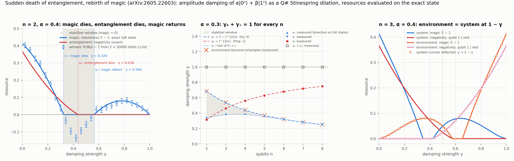
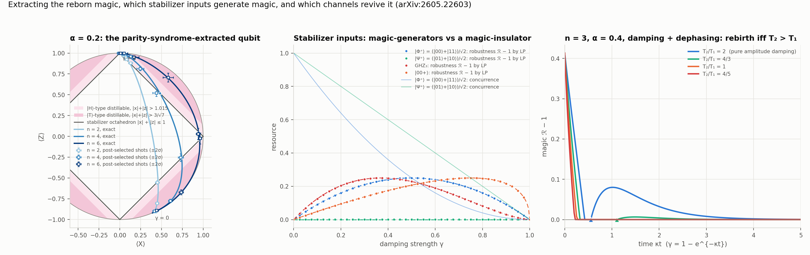

# Sudden death of entanglement, rebirth of magic — in Q#

A Q# demo of *Sudden death of entanglement, rebirth of magic* (Chenfeng Cao —
[arXiv:2605.22603](https://arxiv.org/abs/2605.22603)).

## The claim

Local Markovian noise cannot bring entanglement back: once a state is separable, every
further local channel keeps it separable. Magic (nonstabilizerness, the resource that turns
Clifford circuits into universal ones) behaves differently, because a local channel need not
preserve the stabilizer polytope 𝒮. The paper's instance is the cat family |ψₙ⟩ = α|0ⁿ⟩ + β|1ⁿ⟩
with 0 < α < β, r = α/β, under amplitude damping of strength γ on every qubit. Writing P₀ and
Pₙ for the populations of |0ⁿ⟩ and |1ⁿ⟩ and c for the coherence between them,

  P₀ = α² + β²γⁿ,  Pₙ = β²(1 − γ)ⁿ,  c = αβ(1 − γ)^{n/2}   (Eq. 1),

the damped state is a stabilizer mixture if and only if c ≤ min(P₀, Pₙ), with robustness of
magic ℛ = 1 + 2 max{0, c − P₀, c − Pₙ} (Theorems 1 and 4). Along the trajectory

- magic dies at γ₋, the root of P₀ = c;
- entanglement dies, across every bipartition at once, at γₑ = r^{2/n} (Proposition 2);
- magic is reborn at γ₊ = 1 − r^{2/n} (Eq. 4) and stays until the endpoint |0ⁿ⟩ at γ = 1.

So γₑ + γ₊ = 1 for every n (Eq. 8). The paper traces this reflection to the Stinespring
dilation of amplitude damping: the environment is left in the damped state at the
complementary strength, ρ_E(γ) = ρ_S(1 − γ) (Eq. 9), so the environment register becomes
entangled at exactly the damping strength where the system's magic returns. Three
consequences the demo also covers: the reborn magic is nonlocal (every marginal is diagonal)
yet parity-syndrome extraction concentrates it onto one qubit with no loss of expected
robustness (Theorem 3) and a yield of at most α²/2 per register (Eq. 23); pure stabilizer
inputs are magic-generators or magic-insulators according to whether their support has mixed
Hamming weight, so |Φ⁺⟩ generates magic ℛ − 1 = γ(1 − γ) while |Ψ⁺⟩ never leaves 𝒮 (Eq. 30);
and with concurrent dephasing the rebirth survives if and only if T₂ > T₁ (Theorem 2).

## What the demo does

**Circuits.** `src/Damping.qs` prepares the cat and applies amplitude damping as its
canonical Stinespring isometry (Eq. 83): a controlled Ry from each system qubit onto a fresh
environment qubit, then a CNOT back, |1⟩|0⟩_E ↦ √(1−γ)|1⟩|0⟩_E + √γ|0⟩|1⟩_E. The QDK only
ships Pauli noise, so this is how a non-unital channel is simulated, and it is the natural
choice here: the joint 2n-qubit state is dumped and Python traces out the environment to get
the system, or the system to get the environment. Dephasing is dilated the same way (an Ry on
an ancilla, then a CZ). 16 qubits at n = 8, milliseconds per state.

**Magic.** The signed-decomposition robustness ℛ (Eq. 47). For n ≤ 4 it is computed by a
brute-force linear program over every pure stabilizer state (60, 1080 and 36 720 of them),
which is a formula-free check of Theorem 4 and is what the stabilizer inputs of Sec. VII use.
For larger n the demo reads P₀, Pₙ, c off the exact state (after checking that no other
coherence is present) and uses the paper's closed form, certified at n = 5…8 by the paper's
own primal–dual pair: the dual witness gives a lower bound, the explicit decomposition into
GHZ and basis states (rebuilt and checked numerically) gives an upper bound, and the two
agree. **Entanglement.** Negativity across the qubit 1 | rest cut, and the sign of the
smallest eigenvalue of the partial transpose for the death point; this side needs nothing
from the paper. **Thresholds.** γ₋, γ₊, γₑ located by 40-step bisection on the simulated
states, for n = 2…8 and α ∈ {0.2, 0.3, 0.4}, on the system and on the environment register.
Since the Q# state reproduces Eq. 1 to 1e‑12, the magic thresholds landing on the formulas
is a consistency check of the dilation and the read-off; the entanglement thresholds and the
environment mirror are computed independently of any formula. **The witness, with shots.**
Tr(Wρ) = 1 + 2c − 2 min(P₀, Pₙ) (Eqs. 60–64) from two settings: all qubits in Z gives P₀ and
Pₙ, all qubits in X gives ⟨X^{⊗n}⟩ = 2c. A value above 1 certifies magic for states whose only
coherence is the GHZ one, which is what the damped cat is (and what the exact state confirms);
it is not a general-purpose witness. 2 × 20 000 shots per point. **Extraction.**
`ExtractMagic` measures the n − 1 parities Z_iZ_{i+1} jointly, decodes with a CNOT cascade and
reads the first qubit in X, Y or Z; shots with the trivial syndrome give the decoded Bloch
vector and the acceptance rate (3 × 10 000 shots per point) against Eq. 19.

## Results



**(A)** n = 2, α = 0.4, the paper's Regime II. Magic (blue) reaches zero at γ₋ = 0.324, stays
zero on the gray window, and comes back at γ₊ = 0.564 — after entanglement (red) is gone for
good at γₑ = 0.436. The window [0.324, 0.564] is the one the paper quotes. The circles are
the two-setting witness from shots: it certifies magic at all 19 magic points at 2σ and never
at the six points inside the window. **(B)** Thresholds against n at α = 0.3, from bisection
on the simulated states, on top of the formulas. The squares are γₑ + γ₊, equal to 1 at every
n; the orange crosses are where the environment register becomes entangled, and they sit on
γ₊. The stabilizer window narrows super-exponentially (Proposition 1). **(C)** The mirror as
curves: the environment's magic and negativity (orange, pink) are the system's (blue, red)
reflected about γ = 1/2, to 1.4 × 10⁻¹⁵.

| n | γ₋ | γ₊ | γₑ | γₑ + γ₊ | window Δₙ | regime |
|---|---|---|---|---|---|---|
| 2 | 0.3330 | 0.6855 | 0.3145 | 1.000000 | 0.353 | I |
| 3 | 0.3797 | 0.5375 | 0.4625 | 1.000000 | 0.158 | II |
| 4 | 0.3819 | 0.4392 | 0.5608 | 1.000000 | 0.0574 | III |
| 6 | 0.3176 | 0.3200 | 0.6800 | 1.000000 | 0.00234 | III |
| 8 | 0.2511 | 0.2511 | 0.7489 | 1.000000 | 0.000030 | III |

α = 0.3. The measured γₑ agrees with r^{2/n} to 1e‑12 at every n; the sum γₑ + γ₊ and the
environment's thresholds (reborn at γₑ, entangled from γ₊) hold to the same precision at all
21 (n, α) pairs. Regimes I–III are the paper's Corollary 1 (entanglement dies before magic;
magic dies first but is reborn only after entanglement is gone; rebirth while still entangled).



**(A)** The decoded qubit at α = 0.2 in the Bloch XZ-plane, exact trajectories with
post-selected shots on top. Each trajectory starts at the pure cat (bottom right), enters the
stabilizer octahedron at γ₋, leaves it at γ₊ and ends at |0⟩. The reborn branch reaches
|x| + |z| = 1.02, 1.09 and 1.28 for n = 2, 4, 6: above the |H⟩-type distillation threshold
1.015 for all three, and above the |T⟩-type threshold 3/√7 = 1.134 from n = 6 on, which is
Fig. 5 of the paper. The acceptance probability is P₀ + Pₙ (≥ α² at every n and γ), the
shots reproduce it and the Bloch vector within their error bars, and the expected robustness
on the reborn branch peaks at 0.0200, 0.0191, 0.0199 at the sampled points against the bound
α²/2 = 0.02. **(B)** Stabilizer inputs under the same damping, robustness by LP. |Φ⁺⟩ leaves
𝒮 immediately with ℛ − 1 = γ(1 − γ); |Ψ⁺⟩, its local-Clifford partner with constant-weight
support, gives ℛ = 1 at every one of the 41 damping strengths. GHZ₃ and |00+⟩ follow the
closed profiles of Eq. 33, all to 4 × 10⁻¹⁵. **(C)** Amplitude damping with dephasing at
n = 3, α = 0.4, as a function of time κt; the demo composes the damping dilation with a
phase flip of the strength that gives the coherence factor q^a of Theorem 2 at each time.
With T₂/T₁ = 2 (no dephasing) and 4/3 the magic is reborn, at κt = 0.5527 and 1.1055, both
equal to the paper's q₊ = r^{1/((1−a)n)} to five digits; at T₂ = T₁ and below it never
comes back on the grid to κt = 5.

Full tables are in [`results/summary.txt`](results/summary.txt).

## Running it

```bash
python verify.py       # ~30 s, mostly the 36 720-state LP
python experiment.py   # ~2 min; `python experiment.py thresholds channel` runs single sweeps
python plot.py         # figures + results/summary.txt
```

Requires the `qdk` package, numpy, scipy and matplotlib (all in the root `requirements.txt`).

## Verification

`verify.py` checks:

1. `PrepareCat` matches its numpy mirror.
2. The dilation implements the Kraus channel of Eq. 40 to 10⁻¹⁵, for cats, the five
   stabilizer inputs, and with the phase-flip layer; its environment is E_{1−γ} of the input
   (Eq. 87) and is isospectral with the system (Eq. 88).
3. The damped cat has exactly the populations and coherence of Eq. 1 and no other coherences.
4. The closed-form robustness equals the stabilizer-polytope LP for n = 2, 3, 4 on both magic
   branches and inside the window; the LP gives ℛ(Φ⁺) = 1 + γ(1 − γ) and ℛ(Ψ⁺) = 1; the
   stabilizer-state counts are 60, 1080, 36 720 and the constant-weight insulators number
   8, 32 (Corollary 7) and 220 (the enumeration paragraph after it); the dual witness has
   |Tr(Wσ)| ≤ 1 on every stabilizer state; at n = 5…8 the explicit decomposition meets the
   witness and both equal the closed form.
5. The three bipartitions of n = 4 lose their negativity at the same γ, and it is r^{2/n}.
6. The two-setting witness from 20 000 shots is within 3σ of the exact value at four points,
   and the paper's three-Pauli form 2|⟨ZI⟩| + 2|⟨XX⟩| ≤ 1 + ⟨ZZ⟩ (Eq. 12) holds in the window.
7. Extraction: the decoded state is Eq. 19 and the acceptance rate P₀ + Pₙ, the lossless
   identity Eq. 21 holds, and the post-selected shots agree within 3σ.
8. With a phase flip of strength p the thresholds become ηr^{2/n} and 1 − ηr^{2/n}, η = (1−2p)²,
   still summing to one (Appendix D).
9. Shots are reproducible from the `seed` argument of `qsharp.run`, and the runs the driver
   treats as independent are independent (see below).
10. The n = 2 regime boundaries are 1/√10 and 1/√5, and the α = 0.4 window is [0.324, 0.564].
11. The pointwise n = 2 mirror ℛ(γ) − 1 = ((1 − γ)/γ) 𝒞(1 − γ) (Eq. 13) on the reborn branch.

Two QDK behaviours worth knowing about, both handled in the code:

- `qsharp.run(..., seed=s)` seeds shot i with s + i, so runs seeded s and s + 1 are the same
  outcome stream shifted by one shot, even for different circuits. The first version of this
  demo seeded its three readout runs consecutively, they shared their syndromes exactly, and
  the pooled error bar on the acceptance rate was too small by √3. `driver.py` now spaces
  seeds by 10⁶ and `verify.py` checks that the runs are not shifted copies.
- The sparse simulator drops amplitudes below 10⁻¹⁰, so at γ = 0.999 the |1ⁿ⟩ component of an
  8-qubit cat is gone from the dump. The bisection for γ₊ therefore brackets from the side
  where that amplitude is still 0.01, which is always beyond the threshold (there it is βr).

## Files

| | |
|---|---|
| `src/Damping.qs` | cat preparation, amplitude-damping and phase-flip dilations, gate-code inputs |
| `src/Main.qs` | `Sim*` entry points (dump the joint state), `MeasureCat` (witness settings), `ExtractMagic` |
| `magic.py` | partial traces, GHZ-X read-off, closed-form robustness and its primal–dual certificate, witness, negativity, concurrence, stabilizer-state enumeration and LP, the paper's formulas |
| `driver.py` | Q#/numpy bridge, shot decoding, seed spacing |
| `experiment.py` | the six sweeps |
| `plot.py` | figures and `results/summary.txt` |
| `verify.py` | checks |

## Caveats

- γₑ is the common bipartite negativity threshold, the onset of full separability. Genuine
  multipartite entanglement dies earlier for n ≥ 3 (Remark 1) and is not measured.
- "The environment becomes entangled" refers to entanglement among the n environment qubits
  of the canonical dilation, in the basis the paper identifies with the computational one;
  the environment's magic depends on that choice of dilation, its negativity does not.
- The finite-temperature magic island of Theorem 2(iii) needs a generalized amplitude damping
  dilation and is not implemented; neither are the phase-twist and nonuniform-damping
  variants of the reflection (Appendices E and F) or the Dicke trajectories of Sec. VI.
