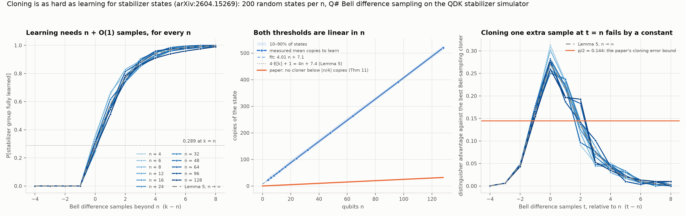

# Cloning is as hard as learning for stabilizer states — measured in Q#

A Q# demo of *Cloning is as Hard as Learning for Stabilizer States* (Bansal, Caro,
Mahajan — [arXiv:2604.15269](https://arxiv.org/abs/2604.15269)).

## The claim

For n-qubit stabilizer states the optimal sample complexity of approximate cloning is
Θ(n): the same as learning them. The paper's cloning task (Definition 12) is a CPTP map
Λ taking t copies to t+1 with worst-case trace distance ≤ ε over the class, and the
result (Theorem 11) is that no such map exists for t ≤ ⌊n/4⌋ and ε ≤ 0.14. The upper
bound is learning: Bell difference sampling recovers the stabilizer group from Θ(n)
copies, after which you can prepare as many copies as you like.

The mechanism is elementary, and it is what the demo measures. A Bell difference sample
of a stabilizer state is a uniformly random element of its unsigned stabilizer group, an
n-dimensional subspace of Z₂^{2n}. Learning the group means collecting n linearly
independent samples. Lemma 5 gives the probability that k uniform samples of an
n-dimensional space span it; at k = n it is Π(1 − 2^{−i}) ≥ 0.28 for every n, and it is
zero at k = n − 1. A cloner that turned n − 1 samples into n would therefore let a
learner succeed with constant probability where it provably cannot. Theorem 6 turns that
into a distinguisher with advantage ≥ 0.14 against any sample amplifier; Theorem 8 shows
Bell measurement is the optimal thing to do with copies of the mixed instance, so a
cloner is no better than an amplifier (Theorem 10, Corollary 7); and since a cloner from
fewer copies would give one from more (Lemma 11), the bound holds for every t ≤ n. The
lift from this mixed-state argument to pure stabilizer states costs a factor 4 in qubits
(the g-purifications are 4n-qubit stabilizer states, Lemma 12), which is where ⌊n/4⌋
comes from.

## What the demo measures

`src/Main.qs` prepares an unknown stabilizer state from a random Clifford circuit, runs
Bell difference sampling on four copies, and measures generators on one copy. Everything
is Base-profile QIR, so it runs on the QDK's stabilizer simulator (`qdk.simulation.run_qir`
with `type="clifford"`) — 4n = 512 qubits at n = 128 take milliseconds per shot.

For n from 4 to 128, 200 random states each:

1. **Learning.** Bell difference samples are collected one at a time and the rank of the
   collected group is recorded after each. At the first k with rank n, the n generators are
   measured jointly on one more copy to read their signs, and the signed group is checked
   against a classical stabilizer tableau of the circuit. Copies used: 4k + 1.
2. **The cloning bound's mechanism.** From the same rank records, the acceptance probability
   of the paper's distinguisher (a uniformly random hypothesis consistent with the samples,
   accepted if it is the true group) is E[1/N(rank)], with N(n, r) = Π_{i=1}^{n−r}(2^i + 1)
   the number of stabilizer groups consistent with r independent samples. The best a
   cloner can do in the Bell-sampling model is replay an element of the span it has seen,
   which leaves the rank unchanged, so the advantage of the distinguisher at t samples is
   E[1/N(r_t)] − E[1/N(r_{t−1})]. Theorem 6 lower-bounds it by p/2 ≥ 0.14 at t = n.



## Results

| | measured | Lemma 5 |
|---|---|---|
| copies to learn, fit over n = 4…128 | 4.005 n + 7.06 | 4 n + 7.43 |
| P[group learned] at k = n samples | 0.24–0.35 (all n) | 0.290 → 0.289 |
| distinguisher advantage at t = n | 0.25–0.31 (all n) | 0.271, bound 0.144 |

- The learning curve P[learned] vs k − n is the same for every n from 4 to 128 (panel A):
  n + O(1) samples, i.e. 4n + O(1) copies, with the O(1) being E[k] − n → 1.607. The fitted
  intercept is a little below 7.43 because the ~1% of states not learned within n + 8
  samples are left out of the mean.
- The sign step never failed: in every one of the 2 191 states whose group was learned, the n
  signs read from a single copy matched the tableau. The learned generators are mostly
  positive (about 15% negative signs, against 40–50% for random elements of the same
  groups). That is a property of the basis, not a bug: a reduced-echelon basis of a
  stabilizer group is the graph-state canonical form up to local Cliffords, and a graph
  state's canonical generators are all positive. `verify.py` checks an explicit graph state
  and cross-checks signs on three independent paths.
- Panel B is the paper's statement in one picture. The measured learner sits on 4n + 7,
  the paper's impossibility line is n/4, and both are straight lines: Θ(n), with a
  constant-factor gap of 16 between this particular learner and the bound.
- Panel C is the proof. The distinguisher's advantage is a bump located at t = n whose
  height does not depend on n — 0.27 measured, 0.271 from Lemma 5, against the paper's
  bound of 0.144 — and that constant is the whole reason cloning cannot be cheaper than
  learning here. Amplifying from t = n − 1 to n samples is exactly one sample too early,
  and Lemma 11 carries the same bound down to every smaller t.

## Running it

The demo uses the official `qdk` package for its stabilizer simulator, in its own venv:

```bash
uv venv .venv && source .venv/bin/activate && uv pip install qdk numpy matplotlib
python verify.py       # ~1 min
python experiment.py   # ~3.5 min
python plot.py
```

## Verification

`verify.py` checks:

1. The Bell-label decoding: for |0…0⟩ every sample has zero X-part.
2. Every Bell difference sample commutes with all stabilizer generators of the state (from
   the tableau), for n = 3, 8, 24.
3. Samples are uniform over the group (n = 4, 16 elements, χ² over 4 000 shots).
4. The rank after k samples follows Lemma 5 (n = 8, 400 states, within 3σ at every k).
5. Signs read from one copy match the tableau's, with full phase tracking, for n = 4, 10, 20.
6. Signs of random group elements (about a third of them negative) agree on three independent
   paths: the stabilizer simulator, the QDK's full-state simulator on the same QIR, and the
   tableau.
7. An explicit graph state's canonical generators X_i Z_N(i) are all +1 on both paths.
8. The hypothesis count N(n, r) = Π(2^i + 1) matches a brute-force enumeration of the 135
   Lagrangian subspaces of Z₂⁶.
9. Π(1 − 2^{−i}) = 0.2888 and p/2 ≥ 0.14.

## Files

| | |
|---|---|
| `src/Main.qs` | Clifford circuit from gate codes, Bell measurement, Bell difference sample, joint generator measurement |
| `tableau.py` | Aaronson–Gottesman stabilizer tableau with phases (ground truth) |
| `learner.py` | Z₂ span, Bell-label decoding, Lemma 5, hypothesis counts, distinguisher advantage |
| `driver.py` | compile to QIR, run on the stabilizer simulator, decode |
| `experiment.py` | the sweep |
| `plot.py` | the figure and `results/summary.txt` |
| `verify.py` | checks |

## Caveats

- The lower bound is worst-case over the class and over all CPTP cloners; the demo measures
  the paper's specific distinguisher against the best cloner in the Bell-sampling model,
  which the paper proves optimal for the phaseless (mixed) instance the bound is built on.
- The learner here is the four-copy Bell difference sampler. Montanaro's original Bell
  sampling uses two copies per sample; either way the slope is a constant and the
  intercept is E[k] − n.
- Random states are prepared by 3n random H/S/CNOT gates, which is generic enough for the
  statistics (they depend only on the group being n-dimensional) but is not a uniformly
  random Clifford.
