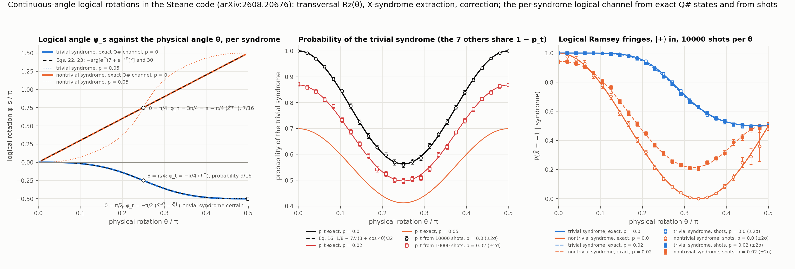
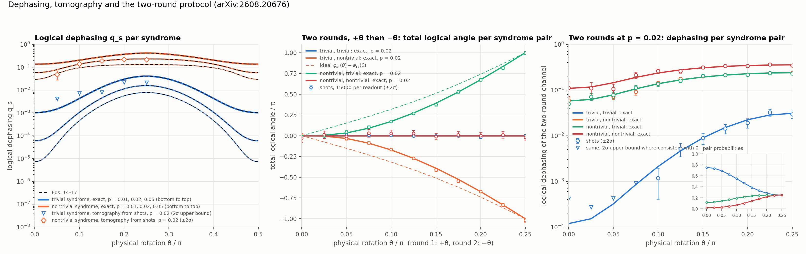
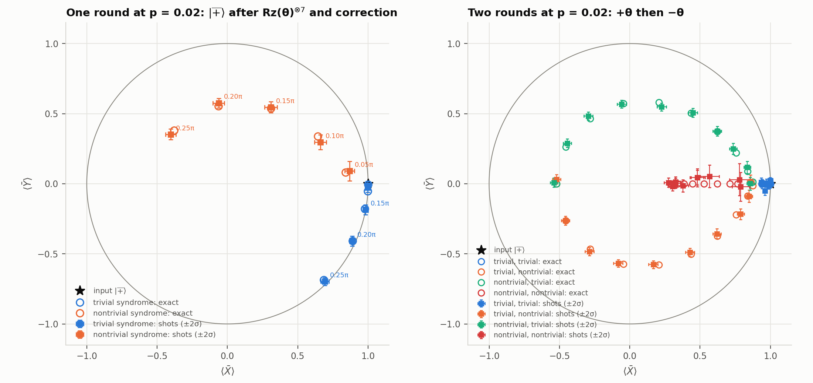

# Continuous-angle logical rotations in the Steane code — in Q#

A Q# demo of *Continuous-angle logical rotations in the Steane code* (Eric Huang, Daiwei Zhu,
Matteo Ippoliti, Christopher Monroe, Michael J. Gullans —
[arXiv:2608.20676](https://arxiv.org/abs/2608.20676)).

## The claim

The [[7,1,3]] Steane code has transversal Cliffords and nothing more, so a transversal
Rz(θ) = exp(−iθZ/2) on all seven qubits leaves the code space for a generic θ. The paper's
protocol is to apply it anyway, then measure the stabilizers with Steane extraction and correct
(for a Z rotation only the X-type syndrome carries information): conditioned on the syndrome s
the net effect on the code space is an exact logical rotation Rz(φₛ), whose
angle depends only on θ and on s (Sec. II.E, after [Cheng et al.](https://arxiv.org/abs/2412.04414)
and [Huang et al.](https://arxiv.org/abs/2510.01319)). In the noiseless case

  φ_t(θ) = −arg[e^{iθ}(7 + e^{−4iθ})²],  φ_n(θ) = 3θ   (Eqs. 22, 23)

for the trivial and any nontrivial syndrome, with probabilities p_t = (25 + 7cos 4θ)/32 and
p_n = (1 − cos 4θ)/32 each (Eqs. 20, 21). With physical dephasing of strength p on every
qubit during the rotation, each branch becomes a logical rotation followed by logical dephasing
qₛ, and the paper derives the coherence factors ηₛ = pₛ(1 − 2qₛ)e^{−iφₛ} in closed form
(Eqs. 14–17, with λ = 1 − 2p). The experimental part runs the one-round protocol on IonQ Forte
as logical Ramsey interferometry and as process tomography, and a two-round +θ/−θ version whose
angles cancel when both rounds give the same syndrome class.

Two consequences of Eqs. 22 and 23 that the demo makes visible: at θ = π/4 the trivial
syndrome (probability 9/16) gives φ_t = −π/4 and every nontrivial one gives 3π/4 = π − π/4, so
one round of transversal T is a logical T† up to a heralded Z̄ (though not a fault-tolerant one:
with dephasing the nontrivial branch is where the errors go, q_n = 0.23 against q_t = 0.016 at
p = 0.02), and at θ = π/2 the trivial syndrome is certain with φ_t = −π/2, which is
Rz(π/2)^⊗7 ∝ S^⊗7 = S̄†, the logical phase gate the code already had transversally.

## What the demo does

**Circuits.** `src/Steane.qs` has the code and the protocol: the |0̄⟩ encoder (H on the pivot
qubit of each row of the parity-check matrix, CNOTs along the rows), the four logical inputs
|0̄⟩, |1̄⟩, |+̄⟩, |+i⟩ from transversal X, H and S† (S̄ is (S†)^⊗7 on this code), the
transversal Rz, X-syndrome extraction with a Steane ancilla block (|0̄⟩ ancilla, transversal
CNOT onto the data, ancilla read in X, syndrome H·x, Fig. 3 of the paper) and with three joint
X-parity measurements as a cross-check, the decoder (the syndrome read as a binary number is
the flagged qubit plus one) with the Z correction applied by feedforward, and transversal
readout in Z, X or Y that Python decodes to the nearest code word. Dephasing is written twice:
as a Stinespring dilation (Ry on a fresh environment qubit, then CZ), which is exact and is
what the dumped states use, and for shots as the same dilation with the environment measured
straight away, which draws the Z flip from the simulator's measurement. A dumped round has
14 qubits (21 while its ancilla block is live), two rounds 21 (28 with the block), and a shot
at most 14 at once, since the environment is released before the block is allocated.

**The exact channel.** For each θ and p, `SimRotated` dumps the state of the four logical
inputs after the rotation and the dephasing. Python traces out the environment, projects the
data register onto each of the eight syndromes with the stabilizer projectors, applies the
correction, restricts to the code space and inverts the four input/output pairs into the 2 × 2
logical channel of that branch. That gives pₛ, ηₛ, φₛ, qₛ, the leakage out of the code space
and how far the branch is from a pure Z rotation, with no formula from the paper involved.
`SimOneRound` and `SimTwoRounds` do the same with the syndrome measured and corrected inside
Q#, and Python checks that the dumped branch is the projected one.

**Shots.** `RunOneRound` returns the three syndrome bits and the seven readout bits. Ramsey
fringes are |+̄⟩ in, X̄ out, grouped by syndrome class. Process tomography prepares the four
logical inputs and reads X̄, Ȳ, Z̄, twelve runs per θ, reconstructs the affine Bloch map of
each branch and splits it as the paper does into a rotation Rz(φₛ) (the least-squares angle)
and a residual whose average gate infidelity and dephasing are reported. `RunTwoRounds` runs
+θ, syndrome, correction, −θ, syndrome, correction, and the X̄ and Ȳ readouts give the angle
and the contraction of the two-round channel per syndrome pair.

**The classical side.** `steane.py` is a numpy mirror of everything (code words, projectors,
Kraus channel, per-syndrome branches, two-round composition) plus the paper's closed forms;
`experiment.py` has four stages and `verify.py` the checks.

## Results



**(A)** The logical angle per syndrome class from the exact Q# channel at p = 0 (thick) on top
of Eqs. 22 and 23 (dashed): the trivial branch barely rotates for small θ, φ_t ≈ −(7/4)θ³, the
nontrivial branches rotate by 3θ. The circles are θ = π/4, where the two differ by exactly π,
and the square θ = π/2, the transversal S. The dotted curves are the same angles at p = 0.05,
where a nontrivial syndrome at small θ is more likely an error than a rotation and the branch
angle falls towards zero. **(B)** The probability of the trivial syndrome against θ, exact for
three noise strengths on top of Eq. 16, with the rates from 10 000 shots. **(C)** Logical
Ramsey fringes P(X̄ = +1 | s) = (1 + (1 − 2qₛ)cos φₛ)/2 from shots, at p = 0 and p = 0.02,
against the exact channel.

| θ | p_t | φ_t | φ_n | note |
|---|---|---|---|---|
| π/16 | 0.9359 | −0.0043π | 0.1875π | |
| π/8 | 0.7812 | −0.0347π | 0.375π | |
| π/4 | 0.5625 = 9/16 | −0.25π | 0.75π | T† up to Z̄ on every syndrome |
| π/2 | 1 | −0.5π | – | transversal S |

The exact channel of every syndrome, at every one of the 65 angles and four noise strengths
of the sweep, is a Z rotation with dephasing (leakage and non-covariance at the 10⁻¹⁵ level), all
seven nontrivial syndromes give the same channel to 2 × 10⁻¹⁶, and pₛ, φₛ and qₛ match
Eqs. 14–17 to 10⁻¹³. The 48 trivial-syndrome rates from shots with a resolvable error bar (the
nontrivial rate of a run is their complement, and p_t = 1 at θ = 0 and π/2 without noise) sit
within 2.8σ of it, and the 91 fringe points with a resolvable error bar within 2.6σ; the other
9 have every shot at the same outcome where the exact fringe is above 0.9999 or exactly 0, or
belong to a syndrome class of probability 0.



**(A)** Logical dephasing against θ for p = 0.01, 0.02 and 0.05 (exact, on top of the closed
forms), with the tomography values from 12 × 5000 shots at p = 0.02. At θ = 0 the trivial
branch dephases at 7p³ (one of the seven weight-three logical Z operators passes undetected)
and a nontrivial one at about 3p (the three weight-two errors with the same syndrome are
miscorrected); the trivial-branch points are 2σ upper bounds, as 5000 shots per setting do not
resolve q_t ≲ 10⁻².
**(B)** Two rounds, +θ then −θ, at p = 0.02: the total angle per syndrome pair from shots
against the exact composition (solid) and the ideal φ_{s1}(θ) − φ_{s2}(θ) (dashed). The two
equal-syndrome pairs stay at zero, the trivial–nontrivial pairs rotate by ±(3θ − φ_t) less the
noise correction. **(C)** The dephasing of the two-round channel per pair, with the pair
probabilities inset. The trivial–trivial pair keeps 1 − 2q_tt = (1 − 2q_t)², the pair
probabilities are p_{s1}·p_{s2}.

| θ | class | fitted φ (shots) | exact φ | q (shots) | exact q |
|---|---|---|---|---|---|
| 0.10π | trivial | −0.012 ± 0.005 π | −0.017π | −0.001 ± 0.004 | 0.0011 |
| 0.10π | nontrivial | 0.134 ± 0.011 π | 0.155π | 0.141 ± 0.011 | 0.137 |
| 0.20π | trivial | −0.131 ± 0.004 π | −0.137π | 0.010 ± 0.006 | 0.011 |
| 0.20π | nontrivial | 0.542 ± 0.011 π | 0.537π | 0.222 ± 0.007 | 0.221 |
| 0.25π | trivial | −0.253 ± 0.005 π | −0.250π | 0.007 ± 0.007 | 0.016 |
| 0.25π | nontrivial | 0.758 ± 0.009 π | 0.750π | 0.215 ± 0.009 | 0.231 |

One-round tomography at p = 0.02 (errors from a parametric bootstrap). The average gate
infidelity of the residual channel after the paper's least-squares split is 2q/3 for a
Z-covariant channel, so it carries the same information as q and is only in the summary. The
two-round shots agree with the exact composition within 3.3σ over the 132 comparisons at
p = 0.02 (angle, dephasing and rate for 44 syndrome pairs; 2.5σ over the 120 with a finite
error bar at p = 0, where three pairs cannot occur at θ = 0), and the trivial–trivial angle is
within 0.02π of zero at every θ.



The XY plane of the logical Bloch sphere, |+̄⟩ in: one round per syndrome class at five
angles (the paper's Fig. 10) and two rounds per syndrome pair (its Fig. 14), shots filled and
the exact channel hollow.

Full tables are in [`results/summary.txt`](results/summary.txt).

## Running it

```bash
python verify.py       # ~1 min
python experiment.py   # ~7 min; `python experiment.py channel ramsey` runs single stages
python plot.py         # figures + results/summary.txt
```

Requires the `qdk` package, numpy and matplotlib (all in the root `requirements.txt`).

## Verification

`verify.py` checks:

1. The encoder matches numpy for all four inputs, |0̄⟩ is the uniform superposition of the 8
   strings generated by the rows of H (weights 0 and 4), all six generators fix the code
   states, the logical Paulis are X^⊗7, Z^⊗7 and iX̄Z̄, and the transversal readouts decode.
2. The dumped data state after the rotation and the dilation equals the Kraus channel of
   Eq. 2 and the diagonal action of Eq. 11 to 10⁻¹⁵; the sampled dephasing gives the same
   syndrome statistics within 3σ, from the Steane block and from joint measurements.
3. The corrected state Q# dumps for a measured syndrome equals the projected branch and is
   back in the code space; in numpy the syndrome distribution does not depend on the logical
   input and the seven nontrivial branches are identical (the Q# dumps of the sweep show the
   same spread, in `channel.csv`).
4. At p = 0 every branch is a unitary Z rotation; the probabilities and angles match Eqs.
   20–23 and the half-angle form tan(φ_t/2) = −(7c⁴s³ + s⁷)/(c⁷ + 7c³s⁴) with c = cos(θ/2),
   s = sin(θ/2); the θ = π/4 and θ = π/2 points; φ_t/θ³ → −7/4.
5. With dephasing, pₛ, φₛ, qₛ match Eqs. 14–17 for p up to 0.1; q_t ∝ p³ and q_n ≈ 3p at
   θ = 0; φₛ(−θ) = −φₛ(θ).
6. Ramsey fringes, the tomography angle and the two-round Bloch vectors and pair rates from
   shots are within 3σ of the exact channel.
7. Two rounds from 21-qubit dumps: shots with the same first syndrome leave the same state,
   every (s1, s2) branch equals the numpy composition, angles add, pair probabilities multiply,
   and 1 − 2q_tt = (1 − 2q_t)².
8. Seeds: reproducible, consecutive seeds are shifted copies, runs one stride apart share
   neither the stream nor a copy shifted by up to three shots, the X and Y readout runs of a
   tomography point do not share their syndromes; the two random-stream behaviours below are
   printed as observations rather than checks, so that a QDK release which changes them does
   not fail.

The checks in groups 1, 3, 4 (unitarity), 6 and 7 use nothing from the paper. The comparisons
with Eqs. 14–17 and 20–23 are consistency checks between the Q# protocol, its numpy mirror and
the paper's algebra.

Two QDK behaviours worth knowing about, both handled in the code:

- Under a `seed`, the classical generator behind `Std.Random.DrawRandomBool` and the one
  behind measurement outcomes are seeded identically for every shot, so the k-th classical
  draw of a shot and its k-th measurement use the same random number: two `DrawRandomDouble`
  coins and two measurements of |+⟩ agree pairwise every time and otherwise at chance. Noise
  sampled with `DrawRandomBool` is therefore correlated with the syndromes measured afterwards,
  and the first version of this demo had a trivial-syndrome rate about 10σ off (0.716 against 0.682)
  with a correct marginal flip rate. The demo now samples the flips by measuring the dilation's
  environment, and `verify.py` prints both the coin coincidence and the bias.
- `qsharp.run(..., seed=s)` seeds shot i with s + i, so runs seeded s and s + 1 are the same
  outcome stream shifted by one shot; the driver spaces seeds by 10⁶ per run.

The built-in `qsharp.PhaseFlipNoise` is not used: it adds a flip after every gate, including
the encoder's and the readout's, which is not the paper's model.

## Files

| | |
|---|---|
| `src/Steane.qs` | code, encoder, logical inputs, transversal Rz, the two dephasing implementations, Steane and joint-measurement syndrome extraction, decoder, transversal readout |
| `src/Main.qs` | `Sim*` entry points (dumps), `Run*` entry points (shots), the random-stream probe |
| `steane.py` | numpy mirror: code words, projectors, Kraus channel, per-syndrome logical channel, two-round composition, shot decoding, tomography fit, the paper's closed forms |
| `driver.py` | Q#/numpy bridge, shot estimators, seed spacing |
| `experiment.py` | the four sweeps |
| `plot.py` | figures and `results/summary.txt` |
| `verify.py` | checks |

## Caveats

- The noise is the paper's theory model, dephasing during the rotation and nothing else. No
  X or Y errors, no preparation, extraction or readout faults, so the residual infidelity the
  hardware shows beyond the dephasing fit (Fig. 9b of the paper) has no counterpart here.
- Only the X-type syndrome is extracted, as in the paper's two-round experiment; the Z-type
  block of Fig. 3 is not needed for Z errors.
- The correction is applied in Q# by feedforward; the paper absorbs it into the readout in
  postprocessing, which is equivalent for a diagonal correction.
- The ancilla block is prepared by the bare encoder. The flag-qubit preparation of Fig. 2 and
  its post-selection are not modelled.
- Angles are reported modulo 2π; φ_n = 3θ wraps beyond θ = π/3, and the unwrapped curves in
  the figures follow the exact channel continuously.
- The paper calls the code word set "the [7,4,3] Hamming code generated by the rows of H_X";
  the rows generate 8 of its 16 words (the [7,3,4] simplex code, its even-weight half), which
  is |0̄⟩, and their complements are |1̄⟩.
